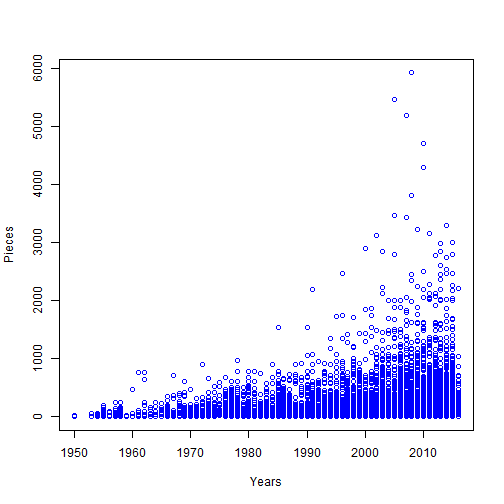

DataProducts
========================================================
author: Ammar Islam
date: 

Developing Data Products Project - LEGO Sets Visualization  
==========================================================

This Shiny App is for searching and visulizating LEGO Sets information.    
The dataset is from [Rebrickable.com](http://rebrickable.com/) that contains the basic information of each set (set id, year, number of pieces, theme, set name).  
Data Source: http://rebrickable.com/downloads  

**Note**: Since I didn't use the API to collect data, the current data might not be 100% accurate.  

It can also be found here: https://ammar760.shinyapps.io/project/ 


Summary of the data
========================================================


```r
data <- read.csv(file = "data/sets.csv")

summary(data)
```

```
     set_id           year          pieces      
 00-1   :    1   Min.   :1950   Min.   :  -1.0  
 00-2   :    1   1st Qu.:1995   1st Qu.:  10.0  
 00-3   :    1   Median :2004   Median :  44.0  
 00-4   :    1   Mean   :2001   Mean   : 156.3  
 00-6   :    1   3rd Qu.:2011   3rd Qu.: 166.0  
 00-7   :    1   Max.   :2016   Max.   :5922.0  
 (Other):10685                                  
                      t1                          descr      
 Town                  :1055   Basic Building Set    :   55  
 Seasonal              : 900   Universal Building Set:   32  
 Technic               : 517   Basic Set             :   23  
 Star Wars             : 490   Helicopter            :   22  
 Service Packs         : 455   Fire Station          :   14  
 Universal Building Set: 441   Fire Truck            :   13  
 (Other)               :6833   (Other)               :10532  
```

Number of Pieces per year
========================================================



Use of Shiny APP
=========================================

This Shiny App is for searching and visulizating LEGO Sets information from year 1950 to 2015. The total number of set records is 10482 and that of theme records is 102. The dataset is from Rebrickable.com that contains the basic information of each set (set id, year, number of pieces, theme, set name).
